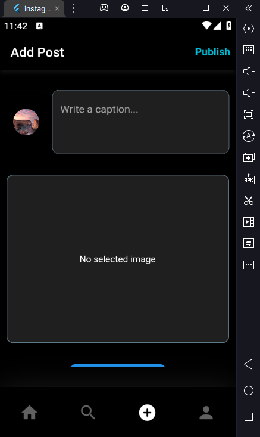
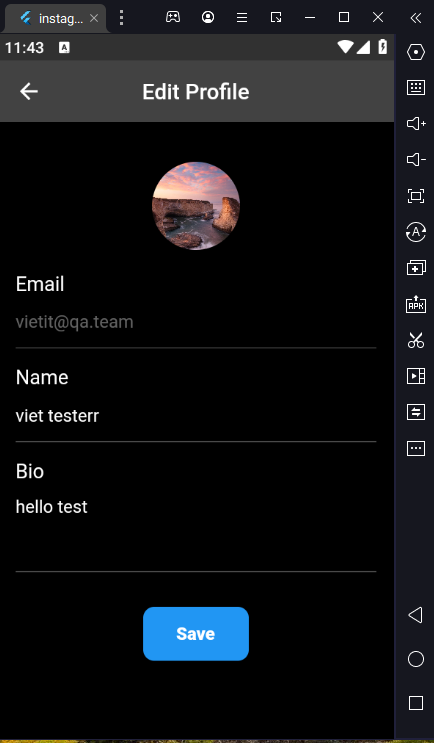
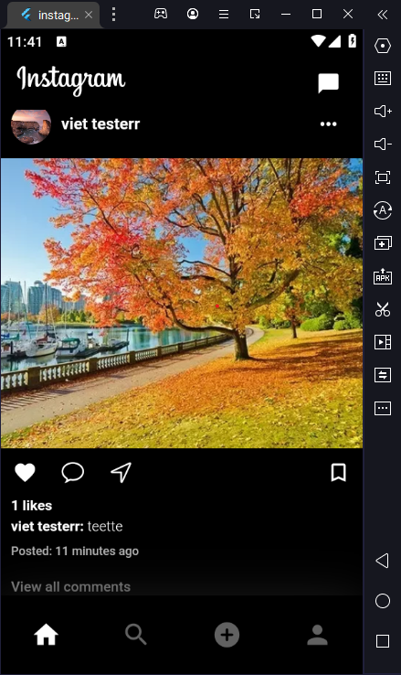
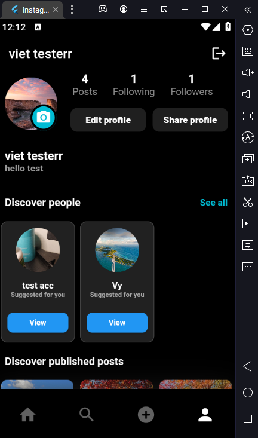
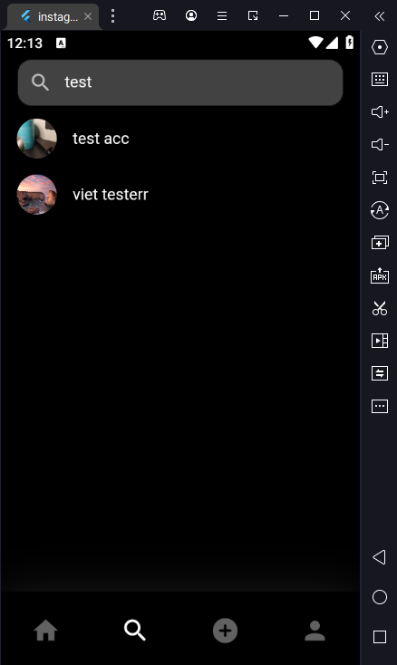
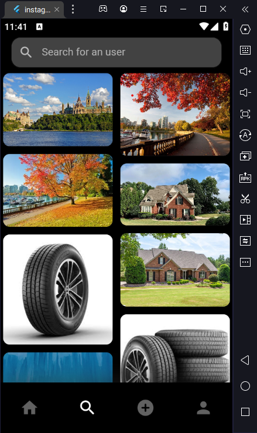
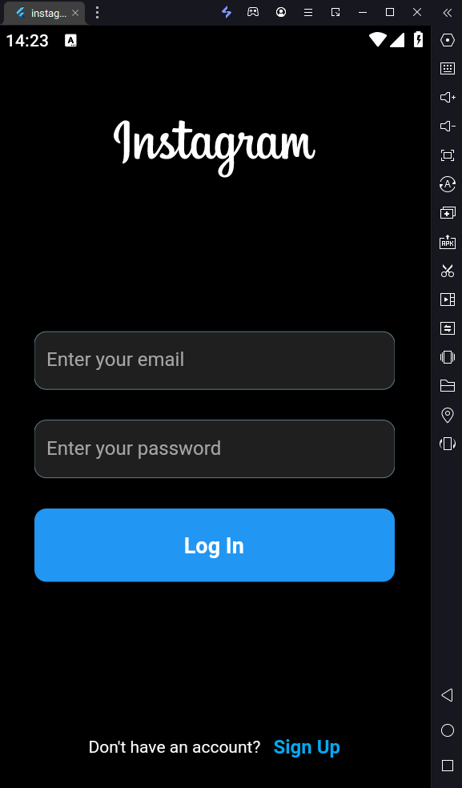
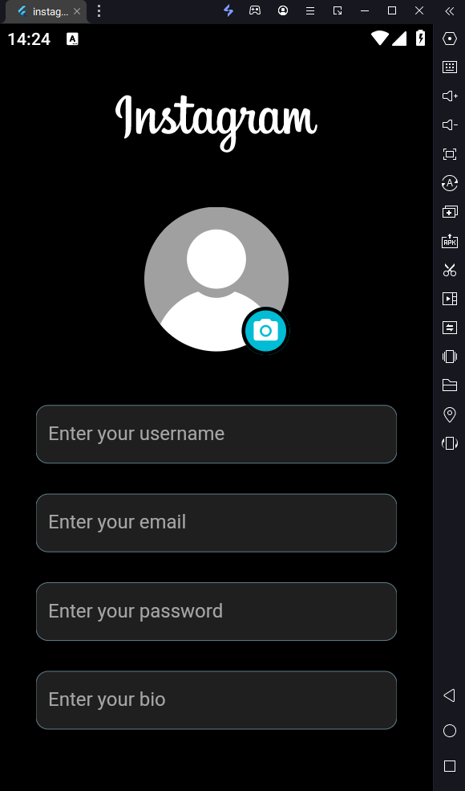
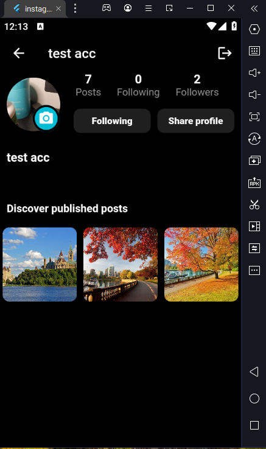

# instagram_clone

## Getting Started

### Core functions:
 - Sign up/Sign in by credentials
 - Upload image profile/update user information
 - Send comments in post
 - Create/update/delete post
 - Follow/Unfollow user
 - Search user

### Demo

#### 1:

    
    
    

#### 2:

    
    
    

#### 3:

    
    
    

